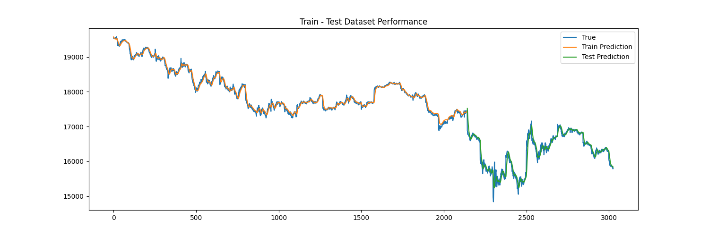
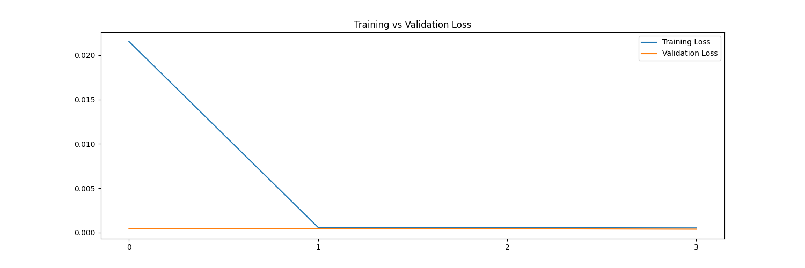

# LSTM Stock Prediction

This is a simple implementation of LSTM model to predict stock prices. Currently this model predicts NASDAQ on 5 min interval quite accurately with an RMSE of ~ 64 on training data and ~ 130, with the NASDAQ price being around 17k, i.e. ~ 0.75% deviation. I know it can't be this simple so something is fishy about this code, but I have no idea why and I have no idea how to diagnose it.

I will be testing this model with live data to figure out if it really is as simple as this to predict NASDAQ.

## Performance
### Train and Test Data Performance 

### Train and Validation Loss Curves

